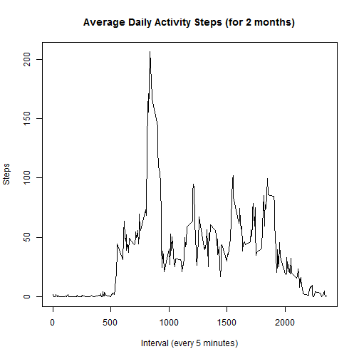
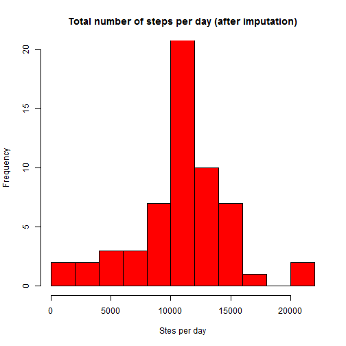

# Reproducible Research: Peer Assessment 1


## Loading and preprocessing the data

```r
library(data.table)
setwd("C:/Users/Administrator/Documents/GitHub/RepData_PeerAssessment1/")
vdata <- data.table(read.csv(unz("activity.zip", "activity.csv"), header = T, 
    sep = ",", na.strings = "NA", colClasses = c("integer", "Date", "integer")))
```


## What is mean total number of steps taken per day?

```r
setkey(vdata, date)
totalstepsperday <- vdata[, list(steps = sum(steps, na.rm = FALSE)), by = date]
hist(totalstepsperday$steps, col = "red", breaks = 10, ylim = range(0, 20), 
    xlab = "Stes per day", main = "Total number of steps per day")
```

 


```r
meansteps <- as.character(round(mean(totalstepsperday$steps, na.rm = TRUE), 
    2))
mediansteps <- as.character(round(median(totalstepsperday$steps, na.rm = TRUE), 
    2))
```

- Mean total number of steps taken per day is *10766.19.*
- Median total number of steps taken per day is *10765.*

## What is the average daily activity pattern?

```r
setkey(vdata, interval)
averagedailyactivity <- vdata[, list(averagesteps = mean(steps, na.rm = TRUE)), 
    by = interval]
plot(averagedailyactivity$interval, averagedailyactivity$averagesteps, type = "l", 
    xlab = "Interval (every 5 minutes)", ylab = "Steps", main = "Average Daily Activity Steps (for 2 months)")
```

 

```r
Maximalnumberofsteps <- round(max(averagedailyactivity$averagesteps), 2)
Interval4MaxStep <- sprintf("%04d", averagedailyactivity$interval[which.max(averagedailyactivity$averagesteps)])
```

- Maximal number of steps *206.17* observed at interval *0835*.


## Imputing missing values

```r
nacount <- length(which(is.na(vdata[[1]])))
```

- Total number of missing values in the data set is *2304*.

### Imputing Strategy
- Use [5-minute interval activity averaged for all date] for imputation
- Join the [original data] with [averaged activity for all date] - left join.


```r
vdatajoined <- vdata[averagedailyactivity]  #left join
vdatajoined <- vdatajoined[order(date)]  #order by date
vdatajoined$stepsimputed <- vdatajoined$steps
filter <- is.na(vdatajoined$steps)  # select the NA rows
vdatajoined$stepsimputed[filter] <- vdatajoined$averagesteps[filter]  #fill with the averaged activity for all date
vdataimputed <- vdatajoined[, list(steps = stepsimputed, date, interval)]
setkey(vdataimputed, date)
totalstepsperdayimputed <- vdataimputed[, list(steps = sum(steps, na.rm = FALSE)), 
    by = date]  #sum (activity) by group (date)
```


```r
hist(totalstepsperdayimputed$steps, col = "red", breaks = 10, ylim = range(0, 
    20), xlab = "Stes per day", main = "Total number of steps per day (after imputation)")
```

 


```r
meansteps <- as.character(round(mean(totalstepsperdayimputed$steps, na.rm = TRUE), 
    2))
mediansteps <- as.character(round(median(totalstepsperdayimputed$steps, na.rm = TRUE), 
    2))
```

- Mean total number of steps taken per day is *10766.19.*
- Median total number of steps taken per day is *10766.19.*


## Are there differences in activity patterns between weekdays and weekends?


```r
library(lattice)
vdataimputed$weekdays <- as.character(as.POSIXlt(vdataimputed$date)$wday)
vdataimputed$weekend <- "weekday"
vdataimputed$weekend[which(vdataimputed$weekdays == "0" | vdataimputed$weekdays == 
    "6")] <- "weekend"
vdataimputed = transform(vdataimputed, weekend = factor(weekend))
setkey(vdataimputed, weekend, interval)
averagedailyactivityimputed <- vdataimputed[, list(averagesteps = mean(steps, 
    na.rm = TRUE)), by = "interval,weekend"]
xyplot(averagesteps ~ interval | weekend, data = averagedailyactivityimputed, 
    layout = c(1, 2), type = "l", xlab = "Interval (every 5 minutes)", ylab = "Steps", 
    main = "Average Daily Activity Steps by Weekday")
```

 

