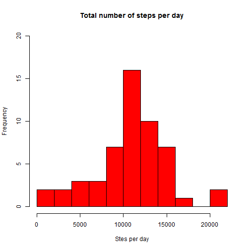
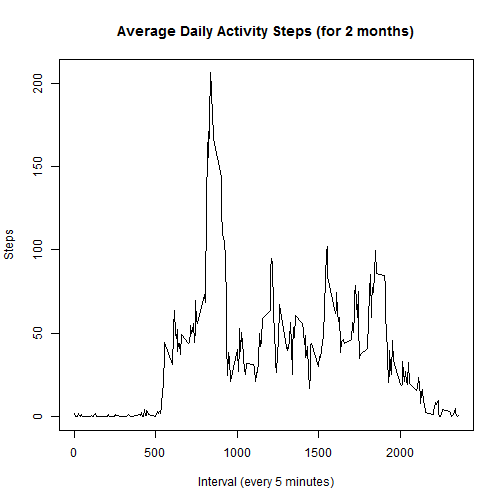
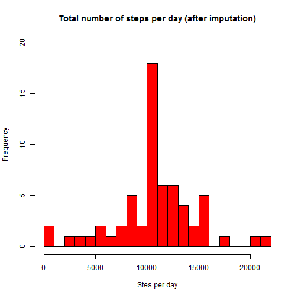
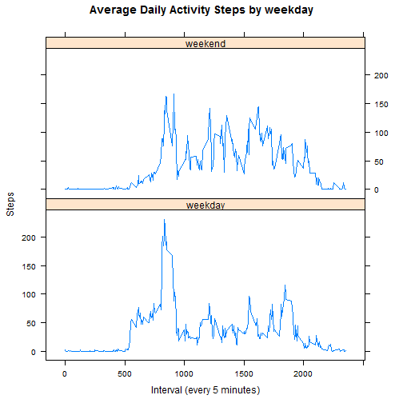

# Reproducible Research: Peer Assessment 1


## Loading and preprocessing the data

```r
library(data.table)
setwd("C:/Users/Administrator/Documents/GitHub/RepData_PeerAssessment1/")
vdata <- data.table(read.csv(unz("activity.zip", "activity.csv"), header = T, 
    sep = ",", na.strings = "NA", colClasses = c("integer", "Date", "integer")))
```


## What is mean total number of steps taken per day?

```r
setkey(vdata, date)
totalstepsperday <- vdata[, list(steps = sum(steps, na.rm = FALSE)), by = date]
hist(totalstepsperday$steps, col = "red", breaks = 20, ylim = range(0, 20), 
    xlab = "Stes per day", main = "Total number of steps per day")
```

 

```r
paste("Mean total number of steps taken per day:", round(mean(totalstepsperday$steps, 
    na.rm = TRUE), 2))
```

```
## [1] "Mean total number of steps taken per day: 10766.19"
```

```r
paste("Median total number of steps taken per day:", round(median(totalstepsperday$steps, 
    na.rm = TRUE), 2))
```

```
## [1] "Median total number of steps taken per day: 10765"
```


## What is the average daily activity pattern?

```r
setkey(vdata, interval)
averagedailyactivity <- vdata[, list(averagesteps = mean(steps, na.rm = TRUE)), 
    by = interval]
plot(averagedailyactivity$interval, averagedailyactivity$averagesteps, type = "l", 
    xlab = "Interval (every 5 minutes)", ylab = "Steps", main = "Average Daily Activity Steps (for 2 months)")
```

 

```r
Maximalnumberofsteps <- round(max(averagedailyactivity$averagesteps), 2)
Interval4MaxStep <- sprintf("%04d", averagedailyactivity$interval[which.max(averagedailyactivity$averagesteps)])
paste("Maximal number of steps", Maximalnumberofsteps, "observed at interval", 
    Interval4MaxStep)
```

```
## [1] "Maximal number of steps 206.17 observed at interval 0835"
```

## Imputing missing values

```r
paste("Total number of missing values in the data set:", length(which(is.na(vdata[[1]]))))
```

```
## [1] "Total number of missing values in the data set: 2304"
```

```r

vdatajoined <- vdata[averagedailyactivity]
vdatajoined <- vdatajoined[order(date)]
vdatajoined$stepsimputed <- vdatajoined$steps
filter <- is.na(vdatajoined$steps)
vdatajoined$stepsimputed[filter] <- vdatajoined$averagesteps[filter]
vdataimputed <- vdatajoined[, list(steps = stepsimputed, date, interval)]

setkey(vdataimputed, date)
totalstepsperdayimputed <- vdataimputed[, list(steps = sum(steps, na.rm = FALSE)), 
    by = date]
hist(totalstepsperdayimputed$steps, col = "red", breaks = 20, ylim = range(0, 
    20), xlab = "Stes per day", main = "Total number of steps per day (after imputation)")
```

 

```r
paste("Mean total number of steps taken per day:", round(mean(totalstepsperdayimputed$steps, 
    na.rm = TRUE), 2))
```

```
## [1] "Mean total number of steps taken per day: 10766.19"
```

```r
paste("Median total number of steps taken per day:", round(median(totalstepsperdayimputed$steps, 
    na.rm = TRUE), 2))
```

```
## [1] "Median total number of steps taken per day: 10766.19"
```

## Are there differences in activity patterns between weekdays and weekends?


```r
library(lattice)
vdataimputed$weekdays <- as.character(as.POSIXlt(vdataimputed$date)$wday)
vdataimputed$weekend <- "weekday"
vdataimputed$weekend[which(vdataimputed$weekdays == "0" | vdataimputed$weekdays == 
    "6")] <- "weekend"
vdataimputed = transform(vdataimputed, weekend = factor(weekend))
setkey(vdataimputed, weekend, interval)
averagedailyactivityimputed <- vdataimputed[, list(averagesteps = mean(steps, 
    na.rm = TRUE)), by = "interval,weekend"]
xyplot(averagesteps ~ interval | weekend, data = averagedailyactivityimputed, 
    layout = c(1, 2), type = "l", xlab = "Interval (every 5 minutes)", ylab = "Steps", 
    main = "Average Daily Activity Steps by weekday")
```

 

